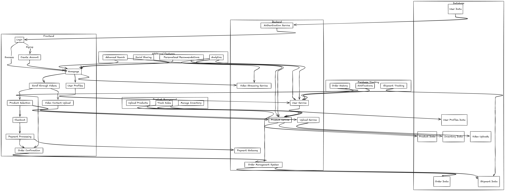

# Snaazr

Snaazr is a next-generation, short video-based eCommerce platform designed to revolutionize the shopping experience by combining engaging video content with a powerful eCommerce backend. Snaazr enables users to explore products through short, engaging videos and make purchases seamlessly, creating a new standard for online shopping.

- [Overview](#overview)
- [Key Features](#key-features)
- [System Architecture](#system-architecture)
  - [Frontend](#frontend)
  - [Backend](#backend)
  - [Database](#database)
- [API Documentation](#api-documentation)
- [Getting Started](#getting-started)
  - [Prerequisites](#prerequisites)
  - [Installation](#installation)
- [Deployment](#deployment)
  - [Docker](#docker)
  - [Kubernetes](#kubernetes)
  - [CI/CD Pipeline](#cicd-pipeline)
- [Testing](#testing)
- [Contributing](#contributing)
- [License](#license)
- [Contact](#contact)

## Overview

Snaazr bridges the gap between social media and eCommerce by offering an engaging, short video format for product discovery and shopping. Users can scroll through videos posted by sellers and influencers, add products to their carts directly from videos, and complete their purchases without leaving the app.

## Key Features

- **Short Video Content**: Discover and purchase products through short, engaging videos.
- **Advanced Search & Filtering**: Search for products by categories, tags, or video creators.
- **Personalized Recommendations**: AI-based algorithms to deliver content tailored to user preferences.
- **Real-time Notifications**: Order tracking, new arrivals, and promotional updates.
- **Integrated Payment Gateways**: Secure and seamless payment processing.
- **Comprehensive Analytics**: Dashboards for sellers to track sales, manage inventory, and analyze performance.
- **Social Sharing**: Share favorite products and videos with friends.

## System Architecture

Snaazr is built using a microservices architecture to ensure scalability, modularity, and ease of maintenance. The platform is divided into three main layers: **Frontend**, **Backend**, and **Database**.

### Frontend

- **Login & Signup**: User authentication and registration flow.
- **Homepage**: The main entry point where users can browse videos and products.
- **User Profiles**: Personal settings, order history, and saved videos.
- **Video Content Upload**: A dedicated interface for sellers to upload new product videos.

### Backend

- **Authentication Service**: Handles all authentication and authorization using JWT tokens.
- **Video Streaming Service**: Delivers video content using a CDN for optimal performance.
- **User Service**: Manages user data, profiles, and preferences.
- **Product Service**: Controls product-related operations like CRUD, inventory management, and sales tracking.
- **Order Management System**: Manages the lifecycle of customer orders, including checkout, payment processing, and order confirmation.
- **Payment Gateway Integration**: Supports multiple payment providers for global reach.
- **Shipment Tracking Service**: Tracks shipments and provides real-time updates to users.

### Database

- **User Data**: Stored in a NoSQL database like MongoDB to allow for flexible schema design.
- **Product Data**: Managed in a relational database like PostgreSQL for complex querying.
- **Order Data**: Stored in a dedicated database optimized for transactional operations.
- **Inventory Data**: Keeps track of stock levels and product variants.
- **Video Uploads**: Video metadata is stored in a database, while the videos themselves are stored in a distributed file system or cloud storage (e.g., AWS S3).
